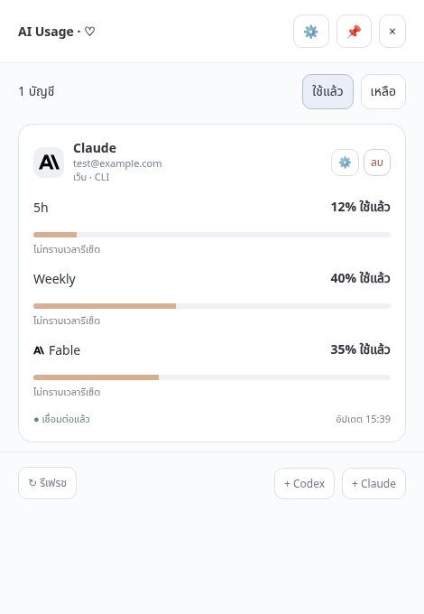

# AI Usage Monitor

โปรแกรม Windows 11 สำหรับดูโควตา Codex และ Claude: หน้ารวมแบบกะทัดรัดและแผงตั้งค่าที่เปิดเมื่อใช้งาน, หลายบัญชี, สลับใช้แล้ว/เหลือ, โควตา 5h/Weekly/Fable ที่แหล่งข้อมูลส่งกลับมา และการแจ้งเตือนแยกบัญชี

## โปรแกรม Windows — งานหลัก

[ดาวน์โหลด Portable 0.3.0 สำหรับ Windows 11 x64](https://github.com/IntraWY/claude-usage-monitor/raw/refs/heads/master/downloads/windows-v0.3.0/AI%20Usage%20Monitor%200.3.0.exe) — ดับเบิลคลิกเปิดได้เลย ไม่ต้องติดตั้ง Node.js รุ่นนี้ยังไม่ได้เซ็นรับรอง และการเชื่อมต่อ Codex ต้องมี Codex CLI ใน PATH

[ไฟล์ SHA256 และคำแนะนำ](https://github.com/IntraWY/claude-usage-monitor/tree/master/downloads/windows-v0.3.0) อยู่ใน `downloads/windows-v0.3.0/`

ซอร์สโค้ดอยู่ใน [`desktop-app/`](desktop-app/README.md)

```powershell
cd desktop-app
npm ci
npm test
npm start
npm run portable:win
```

ไฟล์ build ใน `desktop-app/dist/` ถูก ignore; ฉบับดาวน์โหลดเก็บใน `downloads/` หรือดาวน์โหลด build จาก [Windows desktop Actions](https://github.com/IntraWY/claude-usage-monitor/actions/workflows/windows-desktop.yml) เมื่อ workflow มีผลสำเร็จ

ดู [ข้อกำหนด](docs/requirements.md) และ [สถานะ/ข้อจำกัด](docs/status.md) พร้อม [ผล code review](docs/code-review.md) ก่อนใช้ รุ่นทดลองยังต้องตรวจ Sign in และ usage กับบัญชีจริงบน Windows

## หน้าต่างรุ่น 0.3.0



ภาพจากบัญชีจำลองในการทดสอบ UI; ปุ่มลบหยุดติดตามและเก็บการเข้าสู่ระบบไว้ คืนบัญชีได้จาก ⚙ ของโปรแกรม ส่วน ⚙ ในการ์ดใช้ตั้งแจ้งเตือนและดูโมเดล ไม่มีโหมด Detail แล้ว

## โครงสร้าง repository

| ตำแหน่ง | หน้าที่ |
| --- | --- |
| `desktop-app/src/` | โปรแกรม Windows และตัวเชื่อมต่อบัญชี |
| `downloads/` | Portable EXE พร้อม SHA256 และคำแนะนำ แยกตามรุ่น |
| `desktop-app/test/` | ทดสอบโควตา, Fable, หน้าจอ และหน้าต่าง Windows |
| `extensions/usage-monitor/` | Chrome extension เดิมสำหรับอ่าน Claude usage |
| `extensions/session-optimizer/` | Chrome extension เดิมสำหรับวางแผน session |
| `index.html`, `sw.js`, `manifest.webmanifest`, `icons/` | เว็บ PWA เดิม คงเส้นทาง root ไว้ |
| `api/`, `lib/`, `.env.example`, `package.json` | serverless push API และ dependencies ของเว็บเดิม |
| `docs/` | ข้อกำหนดและสถานะปัจจุบัน; เอกสารออกแบบเว็บเดิมอยู่ใน `docs/legacy/` |
| `.github/workflows/` | ตรวจและ build โปรแกรมบน Windows |

## ส่วนเดิมที่ยังเก็บไว้

เว็บและ extension ทำงานแยกจากโปรแกรม Windows; ไม่ใช่ dependencies ของ desktop app

- เว็บ: รัน `npm ci` ที่ root แล้วใช้ `python3 -m http.server 8000 --bind 127.0.0.1` เพื่อดู UI ภายในเครื่อง HTTP server นี้ไม่รัน `api/*.js`
- Extension: เปิด `chrome://extensions` แล้ว Load unpacked จากโฟลเดอร์ของ extension ที่ต้องการ หากเคยโหลดจากตำแหน่งเดิม ให้เลือกตำแหน่งใหม่ใน `extensions/`
- Push API: ต้องตั้งค่า service ตาม `.env.example`; การจัดไฟล์ครั้งนี้ไม่ได้ตั้งค่าหรือทดสอบการส่ง notification จริง

ลบภาพ/log จากเครื่องมือทดสอบ, mock prototype ที่ถูกแทนด้วยแอปจริง, ไฟล์ session/debug และสคริปต์ทดลอง Kimi แล้ว ไฟล์เดิมยังเรียกคืนได้จาก Git history
